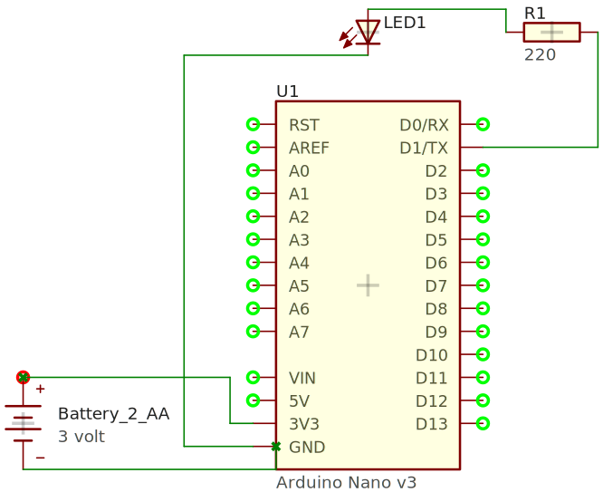
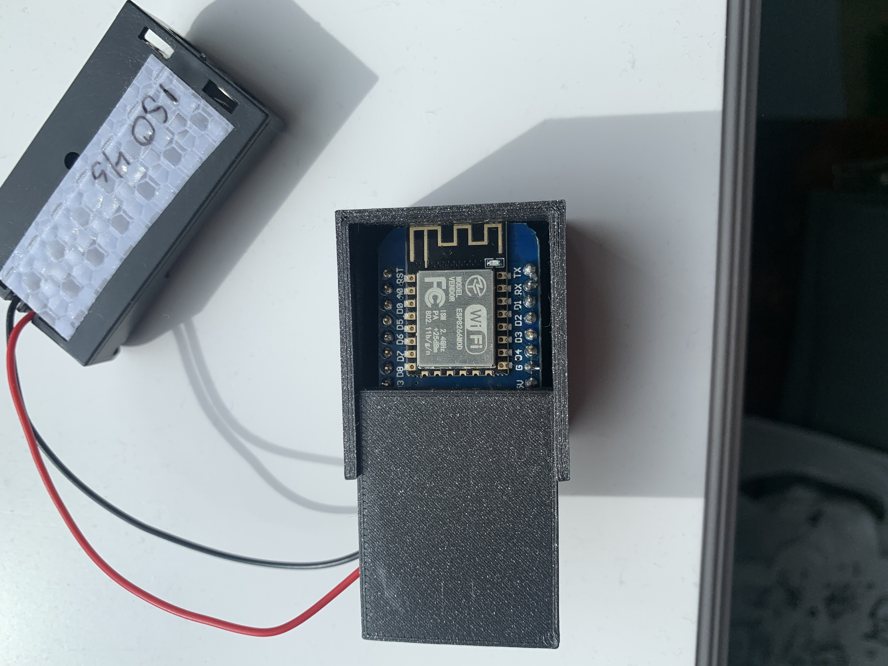

# Arduino-fyr
Instruktion för att bygga en enkel LED fyr för utbildning med hjälp av Arduino. Passande delar går att handla hos tex [Sizable](https://sizable.se/) eller [Kjell & Company](https://www.kjell.com) (Dyrare). 

Materiallista

- [ESP8266-D1-Mini](https://sizable.se/P.URLN7/ESP8266-D1-Mini)
- [Prototypkort](https://sizable.se/P.W6J85/Prototypkort-for-D1-Mini)
- [Färgade LEDs](https://sizable.se/P.QECJ8/5-mm-LED-Kit-med-5-farger)
- [220 Ohm motstånd](https://sizable.se/P.3MSQ6/30-Varden-Motstand-600-st)
- Batterihållare för 2 AA batterier eller powerbank. Viktigt att inte powerbanken stänger av sig efter en stund pga för låg förbrukning.

Principskiss

1. Börja med att löda på stiftlisterna på D1-Mini samt på prototypkortet. se till att de går att klicka ihop.
2. Löd fast motståndet mellan det långa benet (+) på din LED och tex GPIO 1 på prototypkortet. (Märkt TX på D1 Mini kortet.)
3. Löd fast det andra benet på LEDen till GND på D1-Mini via prototypkortet. 
4. För att driva via batteri löd fast batteri + till 3V3 och batteri - till GND på prototypkortet.

Fyren framifrån

Fyren bakifrån

[Fyrkaraktärer](https://fyr.org/wiki/index.php/Fyrkarakt%C3%A4r)

Nu är det dags att lägga in koden antingen genom något av de 3 exemplena som finns här eller genom att ändra till egna karaktärer med hjälp av informationen från sidan ovan. 

Exempel
- fl3s.ino en flash var tredje sekund.
- fl35s.ino tre flashar var femte sekund.
- iso.ino fyra sekunder ljus och fyra sekunder 

För att ladda in koden behövs drivrutiner för valt kort samt [Arduno IDE](https://www.arduino.cc/en/software). För kortet i mitt exempel finns det instruktioner till drivrutinen [här.](https://learn.sparkfun.com/tutorials/how-to-install-ch340-drivers/all)

[Installera extra kort som esp8266 i arduino.](https://randomnerdtutorials.com/how-to-install-esp8266-board-arduino-ide/)

För den som har tillgång till en 3D-skrivare kan en enklare låda skrivas ut. Ladda ner box.stl.

Lådan framifrån

Lådan bakifrån
